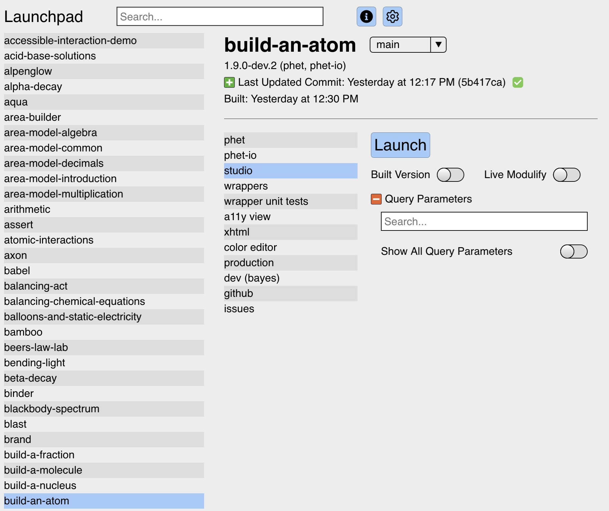
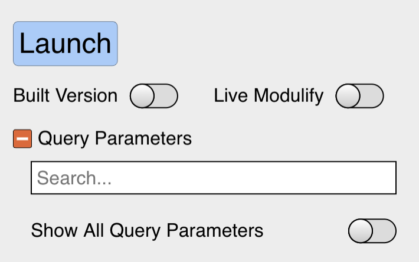
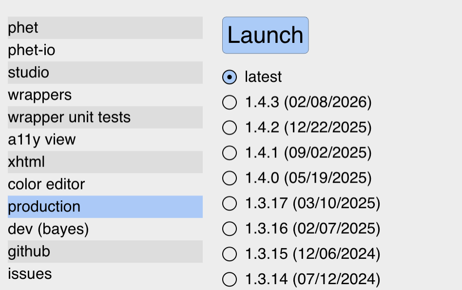
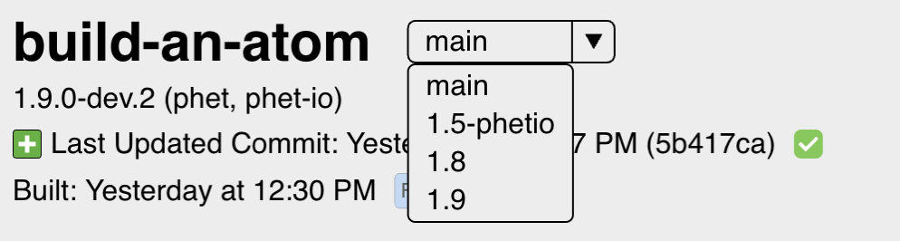
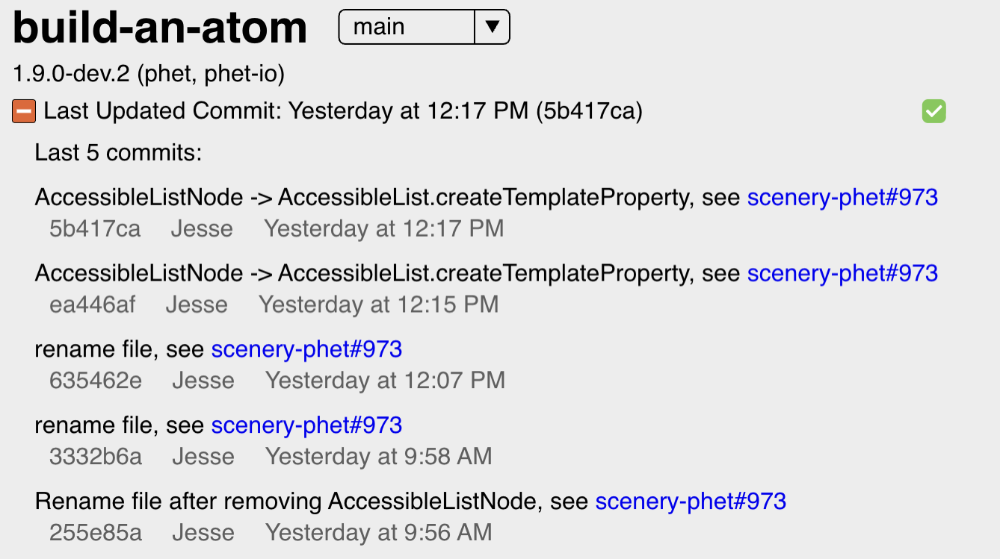
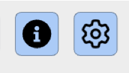
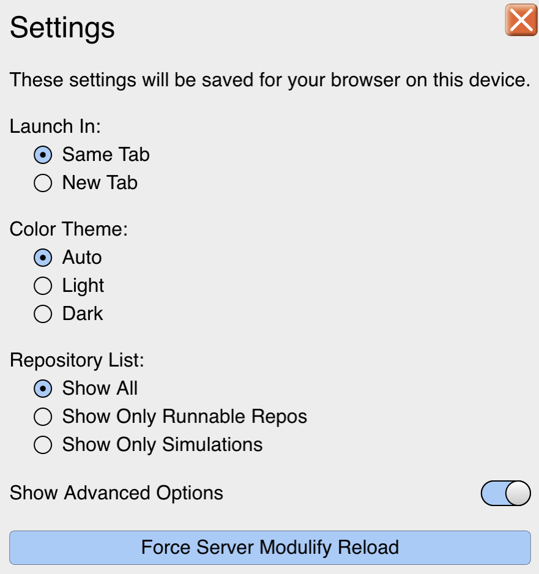
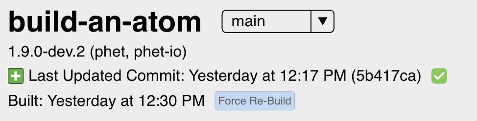
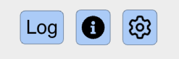

# **Launchpad Documentation**

## **Overview / Getting Started**

Launchpad is a single-screen application used to quickly launch PhET simulation configurations and accompanying applications.

Please see the [README.md](https://github.com/phetsims/launchpad/blob/main/README.md) for notes on launching (no pun intended) both the on-line and local versions.

Start by selecting your repo or simulation from the list on the left. Use the Search bar at the top to quickly narrow your selections. Entering text in the Search bar filters the available simulations or repos as you type. The Search bar supports partial and out-of-order matches, so typing parts of words will still find your intended target. For example, typing "energy skate" will find "energy-skate-park".

The Search bar is automatically focused when Launchpad loads. Begin typing to locate simulations immediately. After identifying your selection, choose the desired feature or mode in the list on the right. Modes include options like "phet", "studio", and others. Single-click to select a simulation and a mode.

To launch, press the **Launch** button or hit **Enter** at any point. Double-clicking an item or clicking an already selected item in either the simulation or mode list will also launch your selection. To switch between branches, use the branch dropdown at the top of the repository, if there are release branches available.

You can modify your search to select both simulations and modes directly from the Search bar. Prefix any search term with a dash ("-") to filter modes instead of simulations. For example, entering "ball \-stu" and pressing **Enter** will select the "studio" mode for "balloons-and-static-electricity" and launch it. If you type a numeric release branch (like "1.4"), Launchpad will select that branch for the simulation, if available. While the Search bar is focused, use the arrow keys to navigate the simulation list.

## **Launch Options**

When available, choose whether to run the **built** or **unbuilt** version of a simulation. If you select an unbuilt version, you have the option to enable **Live Modulify** by checking the corresponding box. Enabling Live Modulify reloads code changes instantly as you work.

Also control which **query parameters** are included when launching. Expand the Query Parameter section, where you will find its own Search bar to filter parameters. Select or deselect the parameters you need. You can add multiple query parameters at once, tailoring the launch to your requirements.

For deployments, select between launching in **dev (bayes)** or **Production** mode. If you need a particular version, use the dropdown to pick a specific version for the simulation before launching. Your selection is reflected in the Launch options area.

## **Additional Options**

You can also select a **Branch** to work from using the branch selector at the top of the screen. 

The latest activity is visible, click the \+ sign to view the last **5 commits** associated with your selection. 

## **Advanced Options**

To adjust your environment, click **Settings**. Here you can view and modify general preferences for Launchpad, such as default launch modes, appearance, or system-wide parameters. All advanced options remain functional regardless of which simulation or mode is selected, ensuring you have quick access to logs, help, and settings at any time. Click the **Info** button for **Documentation,** an in-app guide or further instructions.

Some advanced options, like Log, appear if you enable the “Show Advanced Options” option in your Settings menu.

To ensure you are working with the most recent version, use the **Force** **Re-Build** button to force a rebuild of your chosen simulation. This is useful if there have been code changes that require recompilation.

Another advanced option is the Log button, accessible from the top-right menu. Select **Log file** to view recent activity, system logs, or any errors encountered by Launchpad.

